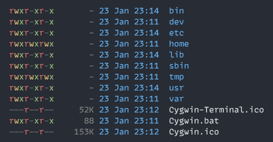

# XF

**Simple Windows Example** 



I am currently implementing windows support first as it will be the hardest to implement. I will most likely implement custom win32 api calls to get permissions, attributes, etc. With that in mind usually the permissions flags in the front are split into 3 groups. Each group being read, write, and execute access for a specific user or group on the system. The first group is the current user, second being for the files main group, and the final being for everyone.

Currently, on windows, I am working to get the permissions for the files main group. However, until I get it working it currently represents the permissions for administrators.

```plaintext
rwx rwx rwx
│   │   └ Everyone
│   └ Group (Administrators)
└ User
```

## Reference

- [Windows File Attributes](https://gist.github.com/CMCDragonkai/657e940bc3802047ea7b314e80d65d15)

## Similar Projects

- [exa](https://github.com/ogham/exa/tree/master)
